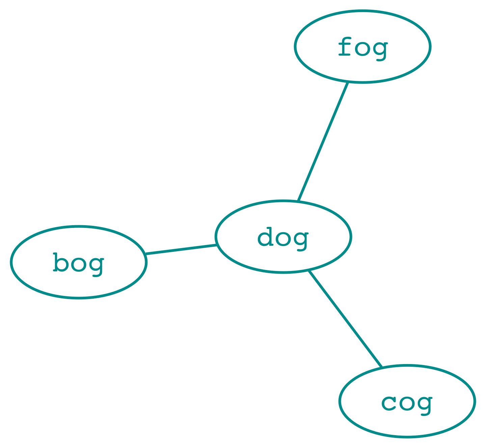
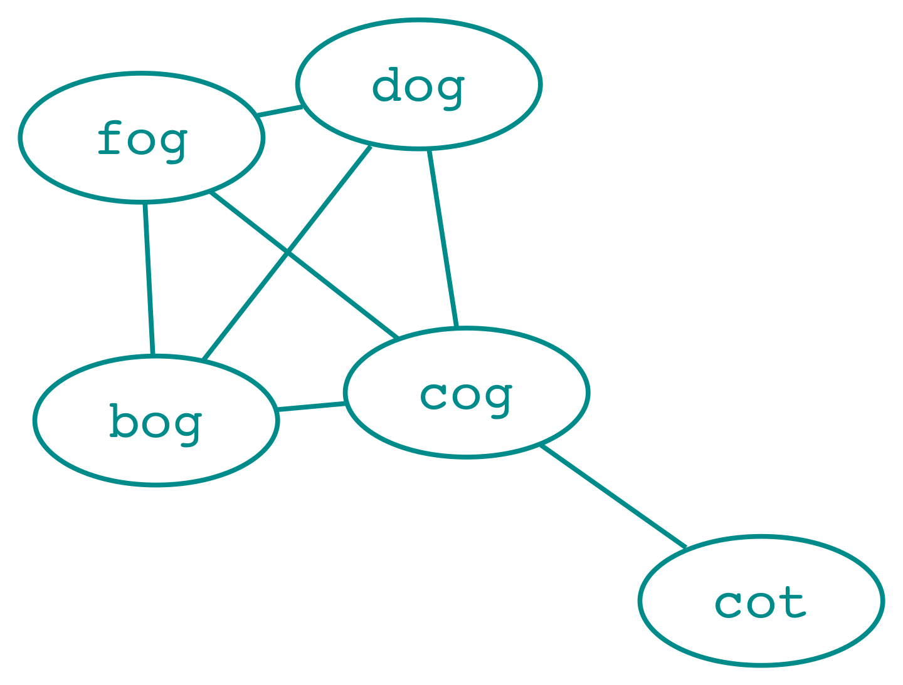
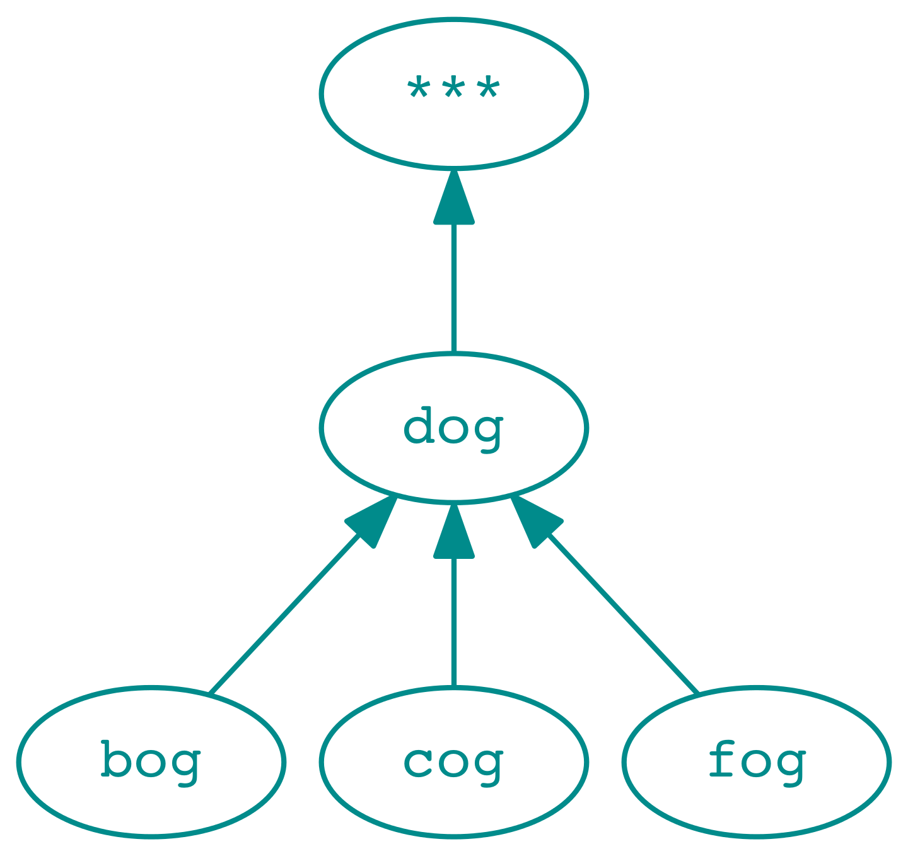
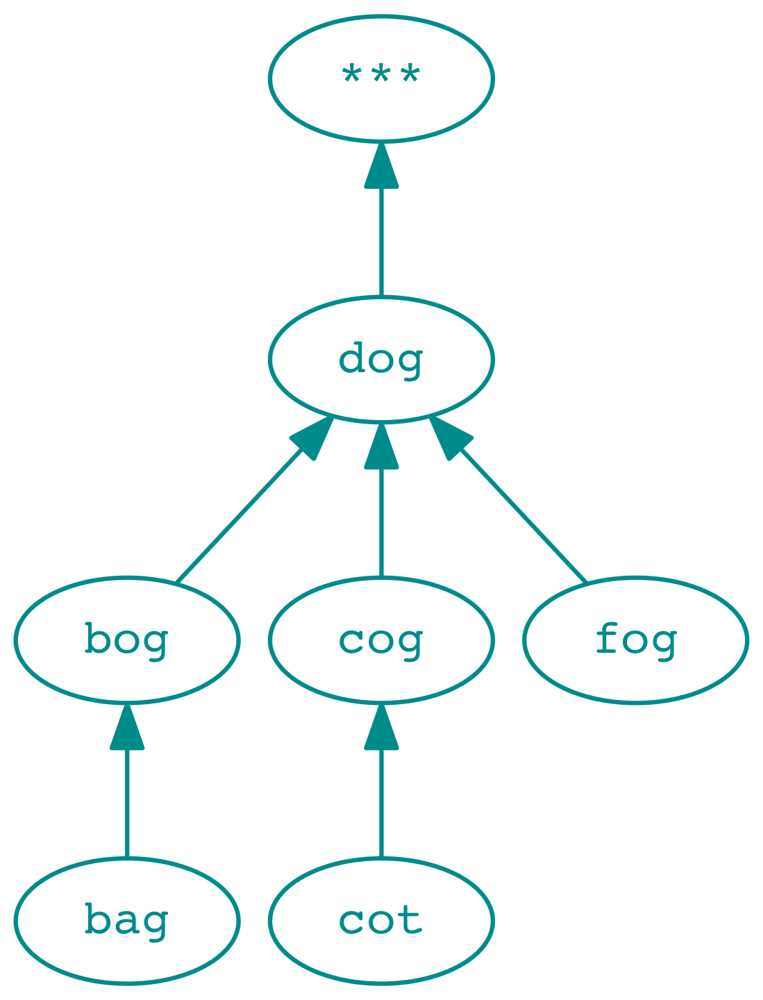

# Ladder
This is a guided exercise: in a small suite of steps, a program is getting coded in Haskell, by you the reader. This guide will indicate *what* is to be done at each step, with examples of use of the functions you will create. The *how* is entirely yours to find out. Enjoy!

## Introduction
A *word ladder* is a list of words having the following characteristics
- all words have the same number of letters
- each word is unique in the list
- each word is distinct from its predecessor in the list by one letter

Here are some examples :
- *dog dot cot cat*
- *warm ward card cord cold*
- *grape grace brace bract brant brunt bruit fruit*


In this exercise, you are given a list of words, such as [this one](http://www-personal.umich.edu/~jlawler/wordlist), and your job is to write a program that prints as short a ladder as possible between two given words. 

The program will read 3 arguments on the command line:

- the name of the file containing the word list
- a starting word *s*
- the target word *t*

The program will then read the word file, and print a ladder of words starting with *s* and ending with *t*. The ladder should be as short as possible. If there is no possible ladder starting with *s* and ending with *t*, then the program will print nothing.

Here's the main program:
```Haskell
import System.Environment

main = getArgs >>= checkArgs >>= readWords >>= printLadder
    where
    checkArgs :: [String] -> IO [String]
    checkArgs args | length args == 3 = return args
    checkArgs args | otherwise        = error "usage: ladder <wordlistfile> <start> <end>"

    readWords :: [String] -> IO ([String],String,String)
    readWords [f,s,t] = do
        cs <- fmap (filter (\w -> length w == length s) . words) $ readFile f 
        return (cs, s, t)

    printLadder :: ([String],String,String) -> IO ()
    printLadder (ws,s,t) = putStrLn $ unwords $ ladder ws s t
```
The definition of the function 
```Haskell
ladder :: [String] -> String ->String -> [String]
```
is missing: let's create it, one step at a time.

## 1. Neighbor
Two words are said to be *neighbors* if the have the same number of letters, and differ only by one letter.
Write a function

```Haskell
neighbor :: String -> String -> Bool
```
that evaluates to `True` if its arguments are neighbors, `False` otherwise. Here are some examples of use of this function:
```Haskell
neighbor "cat" "dog" ⏎
False
neighbor "cat" "bat" ⏎
True
neighbor "cat" "cot" ⏎
True
neighbor "cat" "cob" ⏎
False
neighbor "cat" "cab" ⏎
True
neighbor "dog" "do" ⏎
False
neighbor "at" "cat" ⏎
False
```
*If your definition is using recursion: Can you think of an alternative definition that would use a high order function?*

*If your definition is using high order functions: Can you think of an alternative definition that would use recursion?*
## 2. Connecting neighbors
### 2.1 Neighbors of a word
Let's use our function to retrieve all the words that are neighbor a given word in a word list. This word list will serve as dictionary, so we might as well define a type alias for it: 
```Haskell
type Dictionary = [String]

neighbors :: String -> Dictionary -> [String]
```
Here's an example of use of this function:
```Haskell
let ws = words "bag bat bog dog fog" ⏎

neighbors "fog" ws ⏎
["bog","dog"]

neighbors "bog" ws ⏎
["bag","dog","fog"]
```
*Write an expression of type `[[String]]` that yields the neighbors of the neighbors of "bog" in the word list above*
### 2.2 Connections between words
Keeping track of which word neighbors which other word will be useful if we want to explore the word list. Such a connection between two words deserves a type alias:
```Haskell
type Neighbors = (String,String)
```
Write a function
```Haskell
neighborsTo :: String -> Dictionary -> [Neighbors]
```
that given a word `w` and a list of words `ws`, yields a list `[(n,w),(m,w),..,(z,w)]` of all the neighbors to `w` in `ws`.

Here's an example of use of this function:
```Haskell
let ws = words "bag bat bog dog fog" ⏎

neighborsTo "fog" ws ⏎
[("bog","fog"),("dog","fog")]

neighborsTo "bog" ws ⏎
[("bag","bog"),("dog","bog"),("fog","bog")]
```
## 3. Path
When we have a list of neighbors `[Neighbors]`, each item in this list can be viewed as a step on a word ladder (provided that the list contains the *right* steps of course).
The standard function
```Haskell
lookup :: Eq a => a -> [(a, b)] -> Maybe b 
```
when given a key `k` and a list of pairs `ps`, will return `Just v` if the pair `(k,v)` is present in the list, `Nothing` if this pair is not present.

Using `lookup`, write a function:

```Haskell
path :: String -> [Neighbors] -> [String]
```
that given a word `w` and a list of `Neighbors` `ns`, looks up in that list for the word `x` that may be attached to `w`, then for the word `y` that may be attached to `x`  and so on, until the next word cannot be found in the list. The result of the function is the list `[w,x,y,..,z]` of all the words found on the path.

Here's an example of use of this function:
```Haskell
let ns = [("cat","bat"),("bat","bag"),("bag","bog"),("bog","dog"),("dog","***")] ⏎
path "cat" ns ⏎
["cat","bat","bag","bog","dog"]
path "foo" ns ⏎
[]
```
*For this function to always terminate, what should be true about the list of Neighbors ?*
## 4. Tree 
### 4.1 Neighbors of neighbors
What happens if, armed with the functions we have so far, we try to find neighbors of neighbors? Let's try.
```Haskell
let ws = words "bag bat bog cat cog dog fog" ⏎
neighborsTo "fog" ws ⏎
[("bog","fog"),("cog","fog"),("dog","fog")]
concat $ map (\w -> neighborsTo w ws) $ map fst $ neighborsTo "fog" ws ⏎
[("bag","bog"),("cog","bog"),("dog","bog"),("fog","bog"),("bog","cog"),("dog","cog"),("fog","cog"),("bog","dog"),("cog","dog"),("fog","dog")]
```
*Can you replace* `concat $ map (\w -> neighborsTo w ws) $ map fst` *with a more concise expression?*

*Can we use this expression to find a ladder between the words "cat" and "dog" in the example above ?*

*What about a ladder between the words "bog" and "fog" ?*

### 4.2 From a graph to a tree

If we want to explore a list of words looking for a ladder starting with `s` and ending with `t`, we can proceed as follow:
- look for all the pairs `[(n,t),(m,t),..,(o,t)]` where `[n,m,..,o]` are neighbors of `t`
- look for all the pairs `[(a,n),(b,n),..,(c,n),(d,m),(e,m),..(f,m),(g,o),(h,o),..,(i,o)]`, where `[a,b,..,c]`, `[d,e,..,f]` and `[g,h,..,i]` are neighbors of respectively `[n,m,..,o]`. 
- continue this process until we find the word `s`in our list.

This process results in a *graph* in which each edge links two words that are neighbors.

<p> 



</p>


Finding a ladder between two words is done by exploring this graph in a way that will produce a *tree*. The tree contains the *target* word as its root, and every other word in the graph that is directly or indirectly connected to the *target* word. 

```Haskell
type Tree = [Neighbors]
```
Our `path` function allows us to find the path between *any word in the tree* to the target word. 
However, due to the fact that the `neighbor` relationship is symmetric, for the search to terminate, two properties should hold about the tree we are building:

- there is an edge from `t`, the target word to `𝞊` such that no edge from `𝞊` to any word exists in the list.
- if an edge from `x` to `y` exists in the list, there can be no other edge from `x` to `z` in the list.
<p> 



</p>


Write a function 
```Haskell
initialTree :: String -> Tree
```
Which given a word *w* creates a new tree in which only the pair `(w,𝞊)` is present. The empty string, or `"***"` as a value for 𝞊 will do as well as any value that is not in the word list we will use, or that has a different length than the words we are searching for. 

Then write a function
```Haskell
insertEdge :: String -> String -> Tree -> Tree
```
That given a word `n`, a word `w` and a tree `t`, adds the edge from `n` to `w` in `t`, if no edge from`n` is already present in the tree. 

Then write a function

```Haskell
lookupEdge :: String -> Tree -> Maybe String
```
that given a word `s` and a tree `t`, yields `Just w` if the tree contains an edge from `s` to `w`, `Nothing` if there is no such edge in the tree. 

Here are examples of use of these functions:
```Haskell
let t = insertEdge "cog" "dog" $ insertEdge "fog" "dog" $ initialTree "dog" ⏎
lookupEdge "cog" t ⏎
Just "dog"
lookupEdge "fog" t ⏎
Just "fog"
lookupEdge "dog" t ⏎
Just ""
lookupEdge "cog" $ insertEdge "cog" "fog" t ⏎
Just "dog"
```

Rewrite the function `path`, changing its signature to:
```Haskell
path :: String -> Tree -> [String]
```
and making it so that the function uses your `lookupEdge` function. 
## 5. Explore
In order to know which new neighbor should be explored at a given time, we have to take into account the current tree of words we have built so far. The result of exploring these neighbors yields a list of new words to explore, and a new tree, containing all the existing pairs plus the newly found pairs:
```Haskell
type State =([String],Tree)
```
Write a function
```Haskell
explore :: Dictionary -> String -> Tree -> State
```
that, given a word list `ws`, a word `s` and a tree `t`, will produce a state `([w,x,..,y],u)` such that:
- `[w,x,..,y]` are the neighbors to `s` that are not already present in `t`.
- `u` is a tree that includes all the edges in `t` plus the new edges frow `w` to `s`, `x` to `s`,..,`y` to `s`.

Here are examples of use of the function:
```Haskell
let ws = words "bag bat bog cat cog dog fog" ⏎

let (vs,t) = explore ws "fog" $ initialTree "fog" ⏎
vs ⏎
["bog","cog","dog"]
lookupEdge "fog" t ⏎
Just ""
lookupEdge "bog" t ⏎
Just "fog"
lookupEdge "cog" t ⏎
Just "fog"
lookupEdge "dog" t ⏎
Just "fog"

let (vt,u) = explore ws "bag" t ⏎
vt ⏎
["bat"]
lookupEdge "bat" u ⏎
Just "bag"

fst $ explore ws "fog" u ⏎
[]
```
## 6. Breadth Search
Finding the shortest path between two words involve a *breadth first search* strategy, meaning that all the neighbors of a word should have been visited before the neighbors of these neighbors are. The search process maintains a *queue* of words to visit. Each exploration step extracts the word at the top of the queue, and adds the neighbors of this word at the end of the queue. The process stops either when the list is empty, or when the head of the queue is the word that was sought for.

The function 
```Haskell
breadthSearch :: Dictionary -> State -> State
```
will be in charge of this search process.
### 6.1 Search neighbors, yield new state
Let's start with the first half of the task at hand: implement the `breadthSearch` function so that when it is given a list of word `ws`, and a state `([v,w,..,y],t)`, it returns a new state `([w,..y,n,m,..,o], u)` where:
- the words `[n,m,..,o]` are neighbors of `v` in `ws` that are not already present in `t`
- the new tree `u` has all the neighbor pairs from `t` plus the neighbor pairs `[(n,v),(m,v),..,(o,v)]`

Here are examples of use of this function:
```Haskell
let ws = words "bag bat bog cat cog dog fog" ⏎
let (vs,t) = breadthSearch ws (["fog"],initialTree "fog") ⏎
vs ⏎
["bog","cog","dog"]

map (\w -> lookupEdge w t) vs ⏎
[Just "fog",Just "fog",Just "fog"]

let (vt,u) = breadthSearch ws (vs,t) ⏎
vt ⏎
["cog","dog","bag"]

path "bog" u ⏎
["bog","fog"]
```
*What initial state should the search start with if we are looking for all possible ladders ending with the target word `t` ?*

Write a function
```Haskell
initialState :: String -> State
```
that given a word *w*, yields the state `([w],[(w,"")])` corresponding to the initial queue and tree required to start an exploration from the word *w*.

### 6.2 Stop when there's no more words to visit
Update the function `breadthSearch` so that when in the given state the  visit queue is empty (meaning that there is no more words to visit), then the result is equal to the given state.

Here are new examples of use:
```Haskell
let ws = words "dog fog" ⏎
let search = breadthSearch ws ⏎
fst $ search (["fog"],[("fog","")]) ⏎
["dog"]

fst $ search $ search (["fog"],[("fog","")]) ⏎
[]

fst $ search $ search $ search (["fog"],[("fog","")]) ⏎
[]
```
*Given the word list `ws = words "bag bat cat cot cog dog fog fig"` and an initial state`st = (["dog"],[("dog","")]` how many iterations of `search` are necessary for the resulting state to contain a path from "cat" to "dog" ?*

*How many iterations of `search` are necessary for the resulting state to contain an empty visit queue?* 

### 6.3 Stop when a word has been found
Searching a word list *ws* starting from a word *t* until there's no more words to visit yields a tree that contains all the possible paths to the word *t*. If we are only looking for a specific path between a word *s* and *t*, this search can represent a lot of overhead.

Updtate the function `breadthSearch`, including its signature:
```Haskell
breadthSearch :: Dictionary -> String -> State -> State
```
So that the function, when given a word list *ws*, a stop word *s*, and an initialTree state *st*, will perform a breadth first search on *ws*, stopping when there are no more words to visit, or when the top of the visit queue is *s*.

Here are new examples of use:
```Haskell
let ws = words "dog fog fig" ⏎
let search = breadthSearch ws "dog" ⏎
fst $ search $ initialState "fog" ⏎
["dog","fig"]

fst $ search $ search $ initialState "fog" ⏎
["dog","fig"]

fst $ search $ search $ search $ initialState "fog" ⏎
["dog","fig"]
```
### 6.4 Iterate until the search is done
Now that we have all the different parts of `breadthSearch` right, the last thing to do is to iterate on the search process. Update the function so that when given a word list *ws*, a stop word *s* and state *st*, it searches *ws* until its visit queue is empty or the top of the queue is equal to *s*.

Here are new examples of use:
```Haskell
let ws = words "bog dog fog fig bag bat cat" ⏎
let (vs,t) = breadthSearch ws "dog" $ initialState "fig" ⏎
import Data.List (sort)
unwords $ sort $ map fst t ⏎
"bag bog dog fig fog"
unwords $ path "dog" t ⏎
"dog fog fig"
```
## 7. Ladder 
In order to determine a minimal ladder between two words from a list, we have to process the word list with our `breadthSearch` function, starting with an inital state set to `([t],[(t,"")])` where `t` is the last word of the ladder, and then exploit the second half of the resulting state.

Write a function:
```Haskell
ladder :: Dictionary -> String -> String -> [String]
```
that given a list of words `ws`, a starting word `s`, a target word `t`, yields:
- the list representing the shortest ladder between `s` and `t`
- the empty list if no ladder can be found

Here are some examples of use of this function:
```Haskell
let ws = words "bag bat bog cat cog dog fog" ⏎

unwords $ ladder ws "bag" "fog" ⏎
"bag bog fog"

unwords $ ladder ws "cat" "dog" ⏎
"cat bat bag bog dog"

unwords $ ladder ws "foo" "dog" ⏎
""
unwords $ ladder ws "dog" "qux" ⏎
""
ws <- fmap (filter (\w -> length w == 4) . words) $ readFile "wordlist.txt" ⏎
ladder ws "wood" "iron" ⏎
["wood","good","goad","grad","brad","bran","iran","iron"]
```
Now our program is complete! Here's an example of use:
```
>runhaskell Ladder.hs wordlist.txt bread apple ⏎
bread tread triad trial trill twill swill still stile stole atole amole ample apple
```
## 8 Making the program faster
This program works, but it is disappointingly slow. This is because the neighbors function, which is used at each iteration, filters a large list of words each and every time we have to look for the neighbors of word. 


Let's profile the execution of the example above

```
ghc -prof -fprof-auto -rtsopts Main.hs ⏎
./Main "../data/wordlist.txt" apple bread +RTS -p ⏎
```

We can see that the `breadthSearch` function iterated 1890 times, and `neighbor`, which is at the heart of the program, was called more than 10 millions times!    

```
COST CENTRE                  entries  %time %alloc   %time %alloc

MAIN                              0    0.0    0.0   100.0  100.0
 main                             0    0.0    0.0    99.9  100.0
  main.checkArgs                  1    0.0    0.0     0.0    0.0
  main.printLadder                1    0.0    0.0    97.6   89.7
   ladder                         1    0.0    0.0    97.6   89.7
    breadthSearch              1890    0.0    0.0    97.5   89.7
     breadthSearch.(...)       1889    0.0    0.0    97.2   87.7
      explore                  1889    0.1    0.0    97.2   87.7
       explore.ns              1889    0.0    0.0    92.7   87.7
        explore.ns.\           7509    0.0    0.0    10.1    0.0
         lookupEdge               0   10.1    0.0    10.1    0.0
        neighbors              1889    3.2    0.0    82.6   87.6
         neighbor          10635065   79.4   87.6    79.4   87.6
       explore.u               1889    0.0    0.0     4.4    0.0
        explore.u.\            2271    0.0    0.0     4.4    0.0
         insertEdge            2271    4.4    0.0     4.4    0.0
     breadthSearch.u           1889    0.0    0.0     0.0    0.0
     breadthSearch.vs'         1889    0.3    1.9     0.3    1.9
     breadthSearch.w           1889    0.0    0.0     0.0    0.0
     breadthSearch.ns          1542    0.0    0.0     0.0    0.0
    path                         15    0.0    0.0     0.1    0.0
     lookupEdge                   0    0.1    0.0     0.1    0.0
    initialState                  1    0.0    0.0     0.0    0.0
     initialTree                  1    0.0    0.0     0.0    0.0
  main.readWords                  1    2.1    9.8     2.3   10.3
   main.readWords.\           69903    0.3    0.5     0.3    0.5

```

We could explore ways to reduce the number of calls to neighbors (for instance, by removing from the word list the words that we already added to the tree) but there is no denying that simple lists are not adapted to this kind of search : if our word list contains N words of a given size, then looking for neighbors of a given word in that list will take N-1 calls to  `neighbor` . 

Browsing on [this haskell documentation site](https://haskell-containers.readthedocs.io/en/latest/index.html#), let's have a look at what alternative collections data types we have : 

> ### Maps
>
> Maps (sometimes referred to as dictionaries in other languages) allow you to store associations between *unique keys* and *values*. 

This would be useful if we had already built a list of words with all their neighbors. Then a `dictionary :: Data.Map String [String]` would allows us to find neighbors very efficiently with `Data.Map.lookup`.

> ### Sets
>
> Sets allow you to store *unique*, *ordered* elements, providing efficient insertion, lookups, deletions, and set operations. 

This is something we could use to check if a word exists in our list of words. Actually it allows for a different way to solve the problem of looking for the neighbors of a word: instead of searching all the existing words for words that are neighbors of w, we can:

- generate vs, all the possible neighbors of w 
- check what words in vs exist in our set of english words.

## 8.1 Data.Set

We don't know yet how to generate all possible neighbors of a given word, but we could test this strategy with a simpler problem: finding what english word are an anagram of another english word.

```Haskell
import Data.List as L ⏎
import Data.Set as S ⏎
ws <- fmap words $ readFile "wordlist.txt" ⏎
let slowCheck w = L.elem w ws ⏎

let dict = S.fromList ws ⏎
let fastCheck w = S.member w dict ⏎

:set +s ⏎
L.filter slowCheck $ L.map reverse ws ⏎
["a","ba","aba","abba","tuba","ca","dirca","uca","da","dada","edda","leda","sea","aga",
. . .
"drow","trow","tow","wow","x","y","hay","may","pay","dray","way","sway","yay","hey","z"]
(124.02 secs, 138,478,368 bytes)

L.filter fastCheck $ L.map reverse ws ⏎
["a","ba","aba","abba","tuba","ca","dirca","uca","da","dada","edda","leda","sea","aga",
. . .
"drow","trow","tow","wow","x","y","hay","may","pay","dray","way","sway","yay","hey","z"]
(0.25 secs, 83,673,344 bytes)
```
In that example of use on my machine, `fastCheck` is almost 500 times faster than `slowCheck`! 

*Using the function `Data.Set.intersection` and two sets, devise another way to find the list of all the words from `ws` that have an anagram in `ws`*.
## 9 Variations
Our plan is to replace our list based `neighbors` function with a set based one that will:
- generate a set of words that are one letter variations of the given word
- get the intersection between this set and the "dictionary" set.

We need a function `variations :: String -> Set String` which given a word, yields a set of all the possible variations on that word (hence not including the word itself). For instance, applying this function to the word *dog* would yield the set of following words:

*aog bog cog dag dbg dcg ddg deg dfg dgg dhg dig djg dkg dlg dmg dng doa dob doc dod doe dof doh doi doj dok dol dom don doo dop doq dor dos dot dou dov dow dox doy doz dpg dqg drg dsg dtg dug dvg dwg dxg dyg dzg eog fog gog hog iog jog kog log mog nog oog pog qog rog sog tog uog vog wog xog yog zog*

### 9.1 Prefixes and suffixes of a word
Create a function
```Haskell
prefixes :: String -> [String]
```
that given a word containing the letters *abc..yz* will yield all the possible prefixes: 𝞊,*a*,*ab*,*abc*,..,*abc..y*. Here's an example of use of this function:
```Haskell
prefixes "apple" ⏎
["","a","ap","app","appl"]
```
*Hint: the Data.List library should contain everything required to create this function.*

Create a function
```Haskell
suffixes :: String -> [String]
```
that given a word containing the letters  *abc..xyz* will yield all the possible suffixes : *bc..xyz*,*c..xyz*,..,*xyz*,*yz*,*z*,𝞊. Here's an example of use of this function:
```Haskell
prefixes "apple" ⏎
["pple","ple","le","e",""]
```
### 9.2 Variations over a letter
Write a function
```Haskell
insertLetter :: Char -> String -> String -> String
```
that given a char *c*, and two strings *s* and *t*, will yield a string equal to the sequence *s*, *c*, *t*. Here is an example of use of this function:
```Haskell
insertLetter '*' "foo" "bar" ⏎
"foo*bar"

insertLetter '-' "hel" "lo" ⏎
"hel-lo"
```
Write a function
```Haskell
variations :: String -> Char -> [String]
```
which given a string *w* and a char *c*, will yield the list of words with each letter is replaced in turn with the character *c*. here is an example of use of this function: 
```Haskell
variations "apple" '*' ⏎
["*pple","a*ple","ap*le","app*e","appl*"]
```
*What is the type of the expression: `map (variation "apple")` ?*

### 9.3 Set of all variations
Using the function `Data.Set.fromList` and `Data.Set.delete`, create a function
```Haskell
allVariations :: String -> Set String
```
that given a word *w*, will yield a set of all the possible variations on *w*, except *w* itself. Here is an example of use of this function:
```Haskell
allVariations "bee" ⏎
fromList ["aee","bae","bbe","bce","bde","bea","beb","bec","bed","bef","beg","beh","bei","bej","bek","bel","bem","ben","beo","bep","beq","ber","bes","bet","beu","bev","bew","bex","bey","bez","bfe","bge","bhe","bie","bje","bke","ble","bme","bne","boe","bpe","bqe","bre","bse","bte","bue","bve","bwe","bxe","bye","bze","cee","dee","eee","fee","gee","hee","iee","jee","kee","lee","mee","nee","oee","pee","qee","ree","see","tee","uee","vee","wee","xee","yee","zee"]
```

## 10 New neighbors

Now that we have a function to generate all 1-letter variations of a word, we can rewrite:
```Haskell
neighbors :: String -> Set String -> [String]
```
so that its implementation uses a `Set String` instead of a `[String]` as a dictionary.
*Hint: look back at the palindrome example above for an idea of how to implement `neighbors`*

Here are examples of use of the new function:
```Haskell
ws <- fmap (S.fromList . words) $ readFile "wordlist.txt" ⏎

unwords $ neighbors "fox" ws ⏎
"box fax fix fob foe fog foh foi fop for fou lox nox pox vox"

unwords $ neighbors "apple" ws ⏎
"ample apply"

unwords $ neighbors "bread" ws ⏎
"break bream breed broad dread oread tread"
```
Change the definition of the type alias:
```Haskell
type Dictionary = Set String
```
and the signature of the `explore` function:
```Haskell
neighbors :: String -> Dictionary -> [String]
```
Now the functions
```Haskell
explore :: Dictionary -> String -> Tree -> State
breadthSearch :: Dictionary -> String -> State -> State
ladder :: Dictionary -> String -> String -> [String]
```
will use a set of strings instead of a list of strings.

Finally, change the Main program so as to use a set of strings as well:
```Haskell
import System.Environment
import Ladder
import Data.Set (fromList)

main = getArgs >>= checkArgs >>= readWords >>= printLadder
    where
    checkArgs :: [String] -> IO [String]
    checkArgs args | length args == 3 = return args
    checkArgs args | otherwise        = error "usage: ladder <wordlistfile> <start> <end>"

    readWords :: [String] -> IO (Dictionary,String,String)
    readWords [f,s,t] = do
        cs <- fmap (Data.Set.fromList . words) $ readFile f 
        return (cs, s, t)

    printLadder :: (Dictionary,String,String) -> IO ()
    printLadder (ws,s,t) = putStrLn $ unwords $ ladder ws s t
```
*Can you see other ways to optimize the program?*
